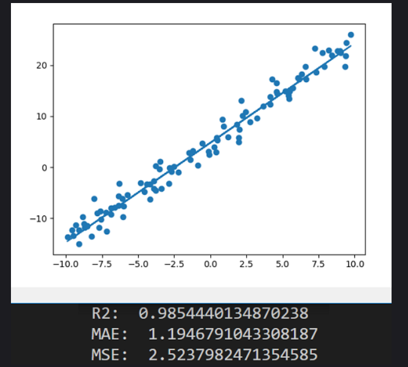

# Exercise

Hallo Leute!

Willkommen bei der nächsten Programmier-Übung in diesem Kurs.

## Aufgabe

Implementiere die folgenden Fehlerfunktionen:

- Mean Absolute Error (MAE): <https://en.wikipedia.org/wiki/Mean_absolute_error>
- Mean Squared Error (MSE): <https://en.wikipedia.org/wiki/Mean_squared_error>

Wende diese dann auf die Lineare Regression aus dem Video davor an.

## Beispiel

